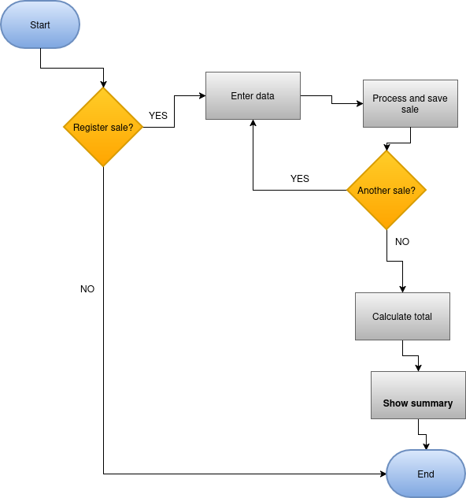

# Sales Register

A Python console application that registers product sales, calculates subtotals, and displays a full sales summary.

## Description

This project is a command-line sales tracking tool. It is designed to help users record multiple product sales interactively. The program is structured around three core functions that handle data entry, calculation, and reporting. It uses a list of dictionaries to store each sale's data in memory during execution.

## How It Works

1. The program starts by calling `registerSale()`, which prompts the user to enter product details in a loop.
2. For each sale, the user provides the product name, price per unit, and quantity. The subtotal is calculated automatically.
3. Each sale is stored as a dictionary inside the `salesList` global list.
4. Once the user finishes registering sales, `calculateTotal()` iterates through the list and sums all subtotals.
5. Finally, `summary()` prints a formatted breakdown of every sale and displays the grand total collected.



## Status

> The program is currently in its initial functional version. It is running correctly for basic sales registration and summary reporting. Future improvements may include file export (CSV/JSON), input validation enhancements, and a graphical interface.

---

### Dependencies

- Python 3.x
- No external libraries are required — the program uses only built-in Python features.

### Installing

- Download or clone the repository to your local machine.
- No additional configuration of files or folders is needed.

### Executing program

Run the script from your terminal:

```bash
python archivos.py
```

- The program will ask if you want to register a sale.
- Type `yes` to enter a product name, price, and quantity.
- Type `no` when you are done to see the full sales summary.
